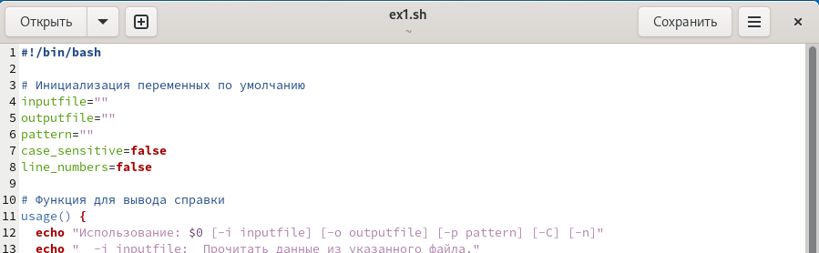
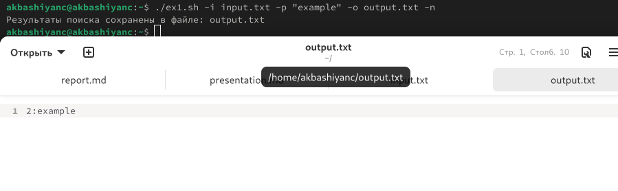
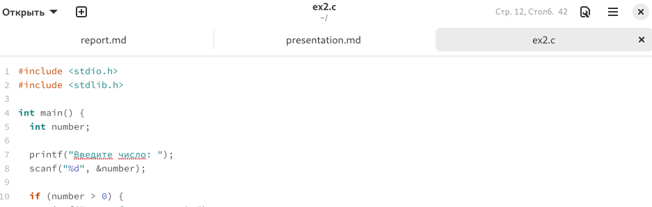
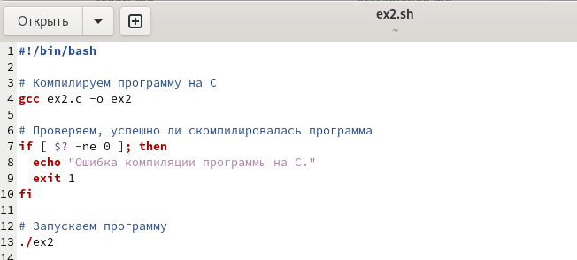
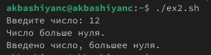
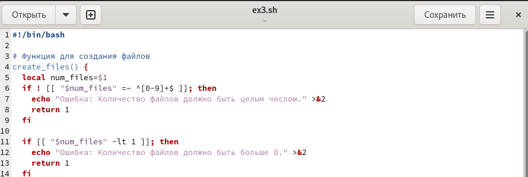
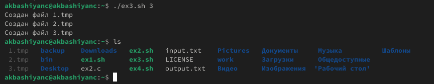
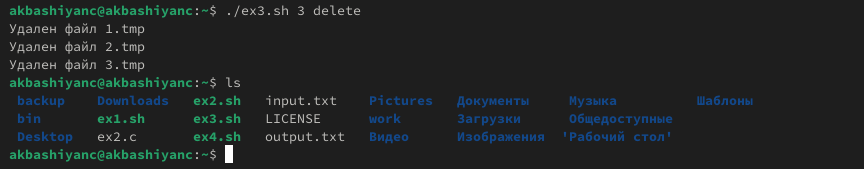
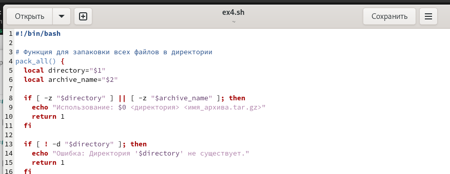
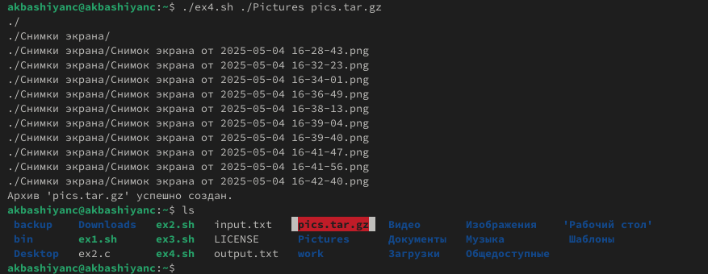

The purpose of this work is to study the basics of programming in the UNIX shell. Learn how to write more complex batch files using logical control structures and loops.

# Task

In this work, it is necessary to study the work of bash scripts.

It is necessary to learn:

* Use logical control structures

* Use cycles

# Getting the job done

Create the files ex1.sh-ex4.sh to do the work (Fig. [-@fig:001]).

{#fig:001 width=70%}

Write a script for task 1 (Fig. [-@fig:002]).

{#fig:002 width=70%}

Execute the file ex1.sh and we will check the correctness of the execution (Fig. [-@fig:003]).

{#fig:003 width=70%}

Create ex2.c files for the C code (Fig. [-@fig:004]).

{#fig:004 width=70%}

Write the code in c (Fig. [-@fig:005]).

{#fig:005 width=70%}

Write a script for task 2 (Fig. [-@fig:006]).

{#fig:006 width=70%}

Execute the file ex2.sh and we will check the correctness of the execution (Fig. [-@fig:007]).

{#fig:007 width=70%}

Write a script for task 3 (Fig. [-@fig:008]).

{#fig:008 width=70%}

Execute the file ex3.sh and check the correctness of the execution (Fig. [-@fig:009]-[-@fig:010]).

{#fig:009 width=70%}

{#fig:010 width=70%}

Write a script for task 4 (Fig. [-@fig:011]).

{#fig:011 width=70%}

Execute the file ex4.sh and we will check the correctness of the execution (Fig. [-@fig:012]).

{#fig:012 width=70%}

# Conclusions

In this paper, we have studied the in-depth operation of bash scripts.
